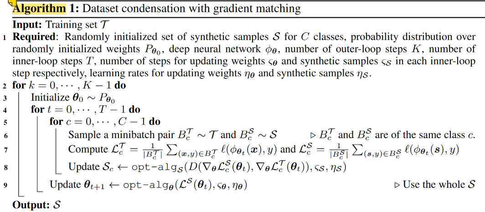

- [What did the authors tried to accomplished?](#what-did-the-authors-tried-to-accomplished)
- [Key elements of the approach](#key-elements-of-the-approach)
- [Takeaway](#takeaway)
- [Other references to follow](#other-references-to-follow)
- [Results (Good or Bad)](#results-good-or-bad)
- [More](#more)

# What did the authors tried to accomplished?

**Main idea.** A training set synehtsis  technioque called **data condensation** that learns to condense **large** dataset into a **small** set of informative synthetic samples.

**How it different ?**. 1) Different to **Generative Adversarial Networks** & **Variational AutoEncoders** that synthesize high-fidelity samples by capturing the data distribution, generate informative samples for training deep neural networks rather than to produce “**real-looking**” samples. 2) differerent to **image reconstruction and recovery**, they synthesize a set of condensed training images not to recover the original or missing training images.

**Goal.**
1. **Compress** large to small in image classiciation
2. highest **generalization** performance - trained on synethic comparable to the original dataset 
3. applicable to **different architectures**

**Previous problems.** Relies on 
1. **heuristics** (e.g. picking cluster centers) that does not guarantee any optimal solution for the downstream task (e.g. image classification)
2. presence of **representative samples**, which is neither guaranteed.

**Motivation.** Dataset Distillation (DD).

# Key elements of the approach

1. formulate as **gradient matching problem** between the gradients of deep neural network weights that are trained on the original and our synthetic data.

💎 **DD method - computational expensive, nested loop**

pose the parameters $\boldsymbol{\theta}^{\mathcal{S}}$ as a function of the synthetic data $\mathcal{S}$. (Bi-level optimisation, **nested loop** optimization).     

**Aim**: find the optimum set of synthetic images $\mathcal{S}^{\ast}$ such that the model $\phi_{\boldsymbol{\theta}s}$ trained on them minimizes the training loss over the original data.
  
$$
\mathcal{S}^{\ast}=\underset{\mathcal{S}}{\operatorname*{arg}\min}\mathcal{L}^{\mathcal{T}}(\boldsymbol{\theta}^{\mathcal{S}}(\mathcal{S}))\quad\text{subject to}\quad\ \boldsymbol{\theta^S}(\mathcal{S})=\underset{\boldsymbol{\theta}}{\text{arg}\min}\mathcal{L^S}(\boldsymbol{\theta})
$$

💎 **Parameter Matching but for only one model**

**Aim**: 
1. The performance is similar to the original dataset
2. The learnt parameters are similar to the one trained on original.

**Explanation.** similar weights $\theta^{\mathcal S},\theta^{\mathcal T}$ imply similar mappings in a local neighborhood and thus generalization performance

$$
\underset{\mathcal S}{\min}D(\theta^{\mathcal S},\theta^{\mathcal T})\quad\text{subject to}\quad\theta^{\mathcal S}(\mathcal S)=\underset{\theta}{\arg\min}\mathcal L^{\mathcal S}(\theta)
$$

💎 **Generalise formula - works for different random initialisation $P\_{\boldsymbol{\theta}\_{0}}$**

$$
\underset{\mathcal S}{\operatorname*{min}}\operatorname{E}_{\boldsymbol{\theta}_0\sim P_{\boldsymbol{\theta}_0}}[D(\boldsymbol{\theta}^{\mathcal S}(\boldsymbol{\theta}_0),\boldsymbol{\theta}^{\mathcal T}(\boldsymbol{\theta}_0))] \quad\text{subject to} \quad \boldsymbol{\theta^{\mathcal S}}(\mathcal S)=\underset{\boldsymbol{\theta}}{\text{arg}\min}\mathcal L^{\mathcal S}(\boldsymbol{\theta}(\boldsymbol{\theta}_0))
$$

💎 **Curriculum gradient matching**
  
Address **problems** of 1) inner optimisation 2) tradeoff of alternative back-optimization approach to inner opt.  
**Key idea:** $\boldsymbol{\theta}^{\mathcal{S}}$ to be close to not only the final $\boldsymbol{\theta}^{\mathcal{T}}$ but also to follow a **similar path** to $\boldsymbol{\theta}^{\mathcal{T}}$ throughout the optimization

**Back-optimization approach** to approximate inner loop optimisation - use a limited number of optimization steps as a tradeoff between speed and accuracy i.e. may not be optimal. It re-defines $\boldsymbol{\theta}^{\mathcal{S}}$ as the output of an **incomplete optimization**

$$
\begin{aligned}\theta^{\mathcal S}(\mathcal S)=&\text{opt-alg}_{\boldsymbol\theta}(\mathcal L^{\mathcal S}(\boldsymbol\theta),\varsigma)\end{aligned}
$$

It restricts the **optimization dynamics** (fixed steps) for $\theta$, but enables a more **guided** (follow similar opt path) optimization and effective use of the **incomplete optimizer** (less computation).

$$
\min_{\mathcal{S}}\operatorname{E}_{\boldsymbol{\theta}_0\sim P_{\boldsymbol{\theta}_0}}[\sum_{t=0}^{T-1}D(\boldsymbol{\theta}_t^{\mathcal{S}},\boldsymbol{\theta}_t^{\mathcal{T}})] \quad
\text{subject to} \quad \begin{aligned}\theta^{\mathcal S}_{t+1}(\mathcal S)&=\text{opt-alg}_{\boldsymbol\theta}(\mathcal L^{\mathcal S}(\boldsymbol\theta^{\mathcal S}_t),\varsigma^{\mathcal S})\end{aligned} \quad \text{and} \quad \begin{aligned}\theta^{\mathcal t}_{t+1}&=\text{opt-alg}_{\boldsymbol\theta}(\mathcal L^{\mathcal t}(\boldsymbol\theta^{\mathcal t}_t),\varsigma^{\mathcal t})\end{aligned}
$$

💎 **Use one step SGD to simplify incomeple optimisation (curriculm based) & obs that parameters similarity is 1**

Update rule for **one step SGD** as $\text{opt-alg}$:
$$
\theta^{\mathcal S}_{t+1}\leftarrow\theta^{\mathcal S}_t-\eta_{\boldsymbol{\theta}}\nabla_{\boldsymbol{\theta}}\mathcal L^{\mathcal S}(\theta^{\mathcal S}_t) \quad \text{and} \quad \theta^{\mathcal T}_{t+1}\leftarrow\theta^{\mathcal T}_t-\eta_{\boldsymbol{\theta}}\nabla_{\boldsymbol{\theta}}\mathcal L^{\mathcal T}(\theta^{\mathcal T}_t)
$$

**Observation**: $(D(\boldsymbol{\theta}\_{t}^{\mathcal{S}},\boldsymbol{\theta}\_{t}^{\mathcal{T}})\approx0)$ and so **Curriculum formula** above is rewritten as below: (note the step symbol $\varsigma$ disappear, the term inside $\mathcal{L}$ is w.r.t $\theta$ i.e. $\theta^{\mathcal S}$, the $\nabla$ is also)

$$
\operatorname*{min}_{\mathcal{S}}\operatorname{E}_{\boldsymbol{\theta}_{0}\sim P_{\boldsymbol{\theta}_{0}}}[\sum_{t=0}^{T-1}D(\nabla_{\boldsymbol{\theta}}{\mathcal{L}}^{\mathcal{S}}(\boldsymbol{\theta}_{t}),\nabla_{\boldsymbol{\theta}}{\mathcal{L}}^{T}(\boldsymbol{\theta}_{t}))]
$$

- This enables they reduce the goal to matching the gradients for the real and synthetic training loss w.r.t. θ via **updating the condensed samples**.
- key advantage over (Wang et al., 2018) and eq. (5) that it does not require the **expensive unrolling** of the **recursive** computation graph over the previous parameters {θ0, . . . , θt−1}.

💎 **Algorithm**

💎 **Gradient matching loss**

# Takeaway

- synthetic data for **each class are separately** (or parallelly) updated at each iteration
  - i) this **reduces memory** use at train time
  - ii) imitating the mean gradients w.r.t. the data from single class is **easier** compared to those of multiple classes.

**More**  

- **Local smoothness** is frequently used to obtain explicit first-order local approximations in deep networks
- back-optimization approach to solve inner optimiastion since inner does not scale

# Other references to follow

**More explanation**:
- By corresponding author: https://www.youtube.com/watch?v=4Pgx-dIz2O4&ab_channel=METUImageLab

**Openreview**
- https://openreview.net/forum?id=mSAKhLYLSsl

**papers**  

1. Dataset Distillation (DD) (Wang) - **first paper**
2. knowledge distillation (KD) - (Hinton et al., 2015)
3. Generative Adversarial Networks
4. Variational AutoEncoders
5. projecting the **feature activations** back to the input pixel space (Zeiler & Fergus, 2014)
6. **reconstruct** the input image by matching the **feature activations** (Mahendran & Vedaldi, 2015),
7. **recover** private training images for given training **gradients**
8. synthesize features from semantic embeddings for zero-shot learning
   

Define **criterion** (e.g. diversity) **for representativeness**:
1. coreset construction (classical data selection methods, clustering problems)
2. continual learning
3. active learning

Extension of the original paper (DD):
- Sucholutsky & Schonlau, 2019; Bohdal et al., 2020; Such et al., 2020

# Results (Good or Bad)

- This approximation - **single step SGD** over nested opt, has the key advantage over (Wang et al., 2018) and eq. (5) that it does not require the expensive unrolling of the recursive computation graph over the previous parameters {θ0, . . . , θt−1}. The important consequence is that the optimization is significantly faster, memory efficient and thus scales up to the state-of-the-art deep neural networks (e.g. ResNet (He et al., 2016)).

- does not rely on the presence of **representative samples** as the synthesized data are directly optimized for the downstream task
- outperforms **DD** (Wang et al., 2018) and **coreset methods** with a wide margin in multiple computer vision benchmarks.  
- significantly smaller (2-3 orders of magnitude)
 
domain

- outperforms popular data selection methods by providing more informative training samples in **continual learning**
- **neural architecture search** : be used to train numerous network architectures extremely efficiently

# More

