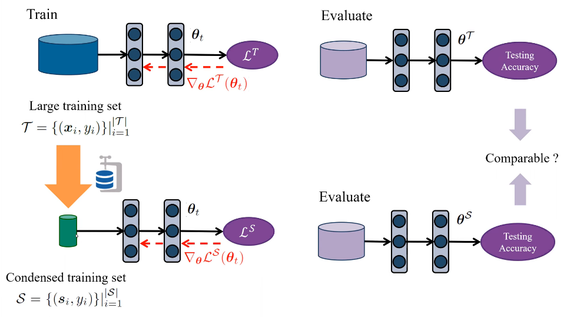
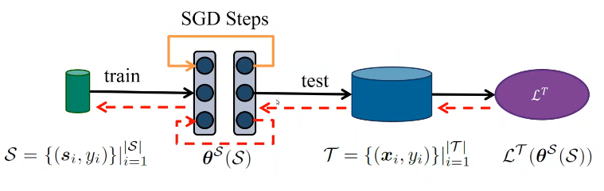
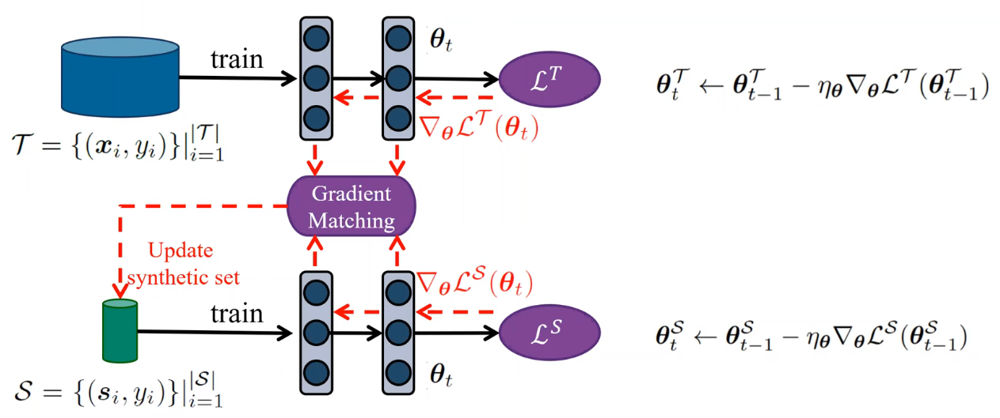

# Dataset condensation with gradient matching

- [Dataset condensation with gradient matching](#dataset-condensation-with-gradient-matching)
- [What did the authors tried to accomplished?](#what-did-the-authors-tried-to-accomplished)
- [Key elements of the approach](#key-elements-of-the-approach)
  - [DD method - computational expensive, nested loop](#dd-method---computational-expensive-nested-loop)
  - [Parameter Matching Method (only for one model)](#parameter-matching-method-only-for-one-model)
  - [Generalise formula - works for different random initialisation $P\_{\boldsymbol{\theta}\_{0}}$](#generalise-formula---works-for-different-random-initialisation-p_boldsymboltheta_0)
  - [Curriculum gradient matching](#curriculum-gradient-matching)
  - [Use one step SGD to simplify incomeple optimisation (curriculm based) & obs that parameters similarity is 1](#use-one-step-sgd-to-simplify-incomeple-optimisation-curriculm-based--obs-that-parameters-similarity-is-1)
  - [Algorithm](#algorithm)
  - [Gradient matching loss](#gradient-matching-loss)
- [Takeaway](#takeaway)
- [Other references to follow](#other-references-to-follow)
- [Results (Good or Bad)](#results-good-or-bad)
- [More](#more)
  - [Openreview](#openreview)
  - [youtube video](#youtube-video)

**Keywords**:

- Dataset distillation (DC), dataset condensation (DD) 
- parameter matching, gradient matching loss, gradient distance metric

# What did the authors tried to accomplished?

**Main idea.** A training set synehtsis  technioque called **data condensation** that learns to condense **large** dataset into a **small** set of informative synthetic samples. Expected comparable performance on the original and the sythetic one.

**How it different ?**. 1) Different to **Generative Adversarial Networks** & **Variational AutoEncoders** that synthesize high-fidelity samples by capturing the data distribution, generate informative samples for training deep neural networks rather than to produce “real-looking” samples. 2) differerent to **image reconstruction and recovery**, they synthesize a set of condensed training images to recover the original or missing training images (not here).

**Goal.**
1. **Compress** large to small in image classiciation
2. highest **generalization** performance - trained on synethic comparable to the original dataset 
3. applicable to **different architectures**

  

**Previous problems.** Relies on 
1. **heuristics** (e.g. picking cluster centers) that does not guarantee any optimal solution for the downstream task (e.g. image classification)
2. presence of **representative samples**, which is neither guaranteed.

  

**Motivation.** Dataset Distillation (DD).  
   
**why & when**  
- Problems that require **training multiple models for multiple times** on the same
dataset (eg hyperparameter search, **neural architecture search**)
- Problems with limited bụdget on **memory** (eg **continual learning**)

**Future work**
- more diverse and thus challenging datasets like **ImageNet** that contain higher resolution images with larger variations in appearance and pose of objects, background

# Key elements of the approach

1. formulate as **gradient matching problem** between the gradients of deep neural network weights that are trained on the original and our synthetic data.

## DD method - computational expensive, nested loop

- pose the parameters $\boldsymbol{\theta}^{\mathcal{S}}$ as a function of the synthetic data $\mathcal{S}$. (Bi-level optimisation, **nested loop** optimization).     

- **DD Problems:**: 
  - nested-loop optimisation - hard to optimise
  - need to unroll the recusive computation graph - not scalable
  

  

- **Aim**: find the optimum set of synthetic images $\mathcal{S}^{\ast}$ such that the model $\phi_{\boldsymbol{\theta}s}$ trained on them minimizes the training loss over the original data.
  
$$
\mathcal{S}^{\ast}=\underset{\mathcal{S}}{\operatorname*{arg}\min}\mathcal{L}^{\mathcal{T}}(\boldsymbol{\theta}^{\mathcal{S}}(\mathcal{S}))\quad\text{subject to}\quad\ \boldsymbol{\theta^S}(\mathcal{S})=\underset{\boldsymbol{\theta}}{\text{arg}\min}\mathcal{L^S}(\boldsymbol{\theta})
$$

## Parameter Matching Method (only for one model)

- **Motivation**: 
Expect models trained on the large dataset and small have
   1. similar **performance** 
   2. similar solution in the **parameter space**.

- **Explanation.** similar weights $\theta^{\mathcal S},\theta^{\mathcal T}$ imply similar mappings in a local neighborhood and thus generalization performance. (Formulate as a constrained satisfaction problem)

- **Problems**
  - involve many **local minima** traps (since distance are large) in the parameter space - hard to optimise
  - need to unroll **recurive computation graph** - not scalable

$$
\underset{\mathcal S}{\min}D(\theta^{\mathcal S},\theta^{\mathcal T})\quad\text{subject to}\quad\theta^{\mathcal S}(\mathcal S)=\underset{\theta}{\arg\min}\mathcal L^{\mathcal S}(\theta)
$$

  

## Generalise formula - works for different random initialisation $P\_{\boldsymbol{\theta}\_{0}}$

$$
\underset{\mathcal S}{\operatorname*{min}}\operatorname{E}_{\boldsymbol{\theta}_0\sim P_{\boldsymbol{\theta}_0}}[D(\boldsymbol{\theta}^{\mathcal S}(\boldsymbol{\theta}_0),\boldsymbol{\theta}^{\mathcal T}(\boldsymbol{\theta}_0))] \quad\text{subject to} \quad \boldsymbol{\theta^{\mathcal S}}(\mathcal S)=\underset{\boldsymbol{\theta}}{\text{arg}\min}\mathcal L^{\mathcal S}(\boldsymbol{\theta}(\boldsymbol{\theta}_0))
$$

## Curriculum gradient matching

- **Motivation:**   Expected similar optimisation throughout the optimsation.  
- **Address the problems:**
  1. avoid nested-loop optimisation  
  2. provide **denser supervision** in the learning process (since match gradient i.e. **learning trajectory** over **model parameters**, "it includes many sub targets in the learning steps")
  3. tradeoff of alternative back-optimization approach to inner opt.  
**Key idea:** $\boldsymbol{\theta}^{\mathcal{S}}$ to be close to not only the final $\boldsymbol{\theta}^{\mathcal{T}}$ but also to follow a **similar path** to $\boldsymbol{\theta}^{\mathcal{T}}$ throughout the optimization

  **Back-optimization approach** to approximate inner loop optimisation - use a limited number of optimization steps as a tradeoff between speed and accuracy i.e. may not be optimal. It re-defines $\boldsymbol{\theta}^{\mathcal{S}}$ as the output of an **incomplete optimization**

$$
\begin{aligned}\theta^{\mathcal S}(\mathcal S)=&\text{opt-alg}_{\boldsymbol\theta}(\mathcal L^{\mathcal S}(\boldsymbol\theta),\varsigma)\end{aligned}
$$

- It restricts the **optimization dynamics** (fixed steps) for $\theta$, but enables a more **guided** (follow similar opt path) optimization and effective use of the **incomplete optimizer** (less computation).

- **steps:**  
  1. match gradient loss between synethic set and large dataset
  2. update synethic set
   

  

$$
\min_{\mathcal{S}}\operatorname{E}_{\boldsymbol{\theta}_0\sim P_{\boldsymbol{\theta}_0}}[\sum_{t=0}^{T-1}D(\boldsymbol{\theta}_t^{\mathcal{S}},\boldsymbol{\theta}_t^{\mathcal{T}})] \quad
\text{subject to} \quad \begin{aligned}\theta^{\mathcal S}_{t+1}(\mathcal S)&=\text{opt-alg}_{\boldsymbol\theta}(\mathcal L^{\mathcal S}(\boldsymbol\theta^{\mathcal S}_t),\varsigma^{\mathcal S})\end{aligned} \quad \text{and} \quad \begin{aligned}\theta^{\mathcal t}_{t+1}&=\text{opt-alg}_{\boldsymbol\theta}(\mathcal L^{\mathcal t}(\boldsymbol\theta^{\mathcal t}_t),\varsigma^{\mathcal t})\end{aligned}
$$

## Use one step SGD to simplify incomeple optimisation (curriculm based) & obs that parameters similarity is 1

Update rule for **one step SGD** as $\text{opt-alg}$:

$$
\theta^{\mathcal S}_{t+1}\leftarrow\theta^{\mathcal S}_t-\eta_{\boldsymbol{\theta}}\nabla_{\boldsymbol{\theta}}\mathcal L^{\mathcal S}(\theta^{\mathcal S}_t) \quad \text{and} \quad \theta^{\mathcal T}_{t+1}\leftarrow\theta^{\mathcal T}_t-\eta_{\boldsymbol{\theta}}\nabla_{\boldsymbol{\theta}}\mathcal L^{\mathcal T}(\theta^{\mathcal T}_t)
$$

**Observation**: $(D(\boldsymbol{\theta}\_{t}^{\mathcal{S}},\boldsymbol{\theta}\_{t}^{\mathcal{T}})\approx0)$ 

Thus, **Curriculum formula** above is rewritten as below: (note the step symbol $\varsigma$ disappear, the term inside $\mathcal{L}$ is w.r.t $\theta$ i.e. $\theta^{\mathcal S}$, the $\nabla$ is also)

$$
\operatorname*{min}_{\mathcal{S}}\operatorname{E}_{\boldsymbol{\theta}_{0}\sim P_{\boldsymbol{\theta}_{0}}}[\sum_{t=0}^{T-1}D(\nabla_{\boldsymbol{\theta}}{\mathcal{L}}^{\mathcal{S}}(\boldsymbol{\theta}_{t}),\nabla_{\boldsymbol{\theta}}{\mathcal{L}}^{T}(\boldsymbol{\theta}_{t}))] \quad \text{s.t.} \quad \theta_{t+1}\leftarrow\theta_t-\eta_{\boldsymbol{\theta}}\nabla_{\boldsymbol{\theta}}\mathcal L(\theta_t) 
$$

- This enables they reduce the goal to matching the gradients for the real and synthetic training loss w.r.t. θ via **updating the condensed samples**.
- key advantage over (Wang et al., 2018) and eq. (5) that it does not require the **expensive unrolling** of the **recursive** computation graph over the previous parameters {θ0, . . . , θt−1}.

## Algorithm

- Updates
  - synethic data - by distaince metric
  - model - by standard loss on sythetic dataset

  

## Gradient matching loss 

Pros of **layerwise losses**:
- enables using a **single learning rate** across all layers
- In contrast to (Lopez-Paz et al., 2017; Aljundi et al., 2019; Zhu et al., 2019) that ignore the **layer-wise structure** by flattening tensors over all layers to one vector and then computing the distance between two vectors, we **group them for each output node**
  
sum of **layerwise losses** as

$$
D(\nabla_{\boldsymbol{\theta}}\mathcal{L}^{\mathcal{S}},\nabla_{\boldsymbol{\theta}}\mathcal{L}^{\mathcal{T}})=\sum_{l=1}^L d(\nabla_{\boldsymbol{\theta}^{(l)}}\mathcal{L}^{\mathcal{S}},\nabla_{\boldsymbol{\theta}^{(l)}}\mathcal{L}^{\mathcal{T}})
$$

and

$$
\begin{aligned}d(\mathbf{A},\mathbf{B})=\sum_{i=1}^{\text{out}}\left(1-\frac{\mathbf{A_i.}\cdot\mathbf{B_i.}}{\|\mathbf{A_i.}\|\|\mathbf{B_i.}\|}\right)\end{aligned}
$$

Decompose
- gradients into layers (with weights)
- each **layerwise** gradient into smaller groups which are connected to every **output neuron** in every layer and then vectorize each group.
- Fully-connected layer: out x (in)
- Convolutional layer: out x (in x hx w).

  

# Takeaway

- Gradient matching loss - **layer-wise**
- synthetic data for **each class are separately** (or parallelly) updated at each iteration 
  - i) this **reduces memory** use at train time
  - ii) imitating the mean gradients w.r.t. the data from single class is **easier** compared to those of multiple classes.

- effectiveness and robustness of the proposed gradient distance metric - gradient matching loss

**More**  

- **Local smoothness** is frequently used to obtain explicit first-order local approximations in deep networks
- back-optimization approach to solve inner optimiastion since inner does not scale

# Other references to follow

**Relevant papers**  

1. Dataset Distillation (DD) (Wang) - **first paper**
2. Dataset Condensation with Differentiable Siamese Augmentation - **data agumentation** with condensed images
3. Soft-label dataset distillation and text dataset distillation. (Sucholutsky et. al. arXiv 2019)
4.  Flexible dataset distillation: Learm labels instead of images. (Bohdal et. al. NeurlPs Workshops 2020.)
5. Generative teaching networks Acceterating neural architecture search by learning to generate synthetic training data.
(Such et. al. 1CML 2020.)

**More explanation**:
- skim✅ By  **corresponding author**: https://www.youtube.com/watch?v=4Pgx-dIz2O4&ab_channel=METUImageLab
- ✅ By **author**, ICML poster pre 2021 : https://iclr.cc/virtual/2021/oral/3391

- **Openreview:** https://openreview.net/forum?id=mSAKhLYLSsl

**Extended related works**
- Variations of Dataset Distillation
- Zero-shot Knowledge Distillation
- Data Privacy & Federated Learning

**More papers**

3. knowledge distillation (KD) - (Hinton et al., 2015)
4. Generative Adversarial Networks
5. Variational AutoEncoders
6. projecting the **feature activations** back to the input pixel space (Zeiler & Fergus, 2014)
7. **reconstruct** the input image by matching the **feature activations** (Mahendran & Vedaldi, 2015),
8. **recover** private training images for given training **gradients**
9. synthesize features from semantic embeddings for zero-shot learning
   

Define **criterion** (e.g. diversity) **for representativeness**:
1. coreset construction (classical data selection methods, clustering problems)
2. continual learning
3. active learning

Extension of the original paper (DD):
- Sucholutsky & Schonlau, 2019; Bohdal et al., 2020; Such et al., 2020

# Results (Good or Bad)

**Pros**  

- This approximation - **single step SGD** over nested opt, has the key advantage over (Wang et al., 2018) and eq. (5) that it does not require the expensive unrolling of the recursive computation graph over the previous parameters {θ0, . . . , θt−1}. The important consequence is that the optimization is significantly faster, memory efficient and thus scales up to the state-of-the-art deep neural networks (e.g. ResNet (He et al., 2016)).

- does not rely on the presence of **representative samples** as the synthesized data are directly optimized for the downstream task
- outperforms **DD** (Wang et al., 2018) and **coreset methods** with a wide margin in multiple computer vision benchmarks.  
- significantly smaller (2-3 orders of magnitude)
 
domain

- outperforms popular data selection methods by providing more informative training samples in **continual learning**
- **neural architecture search** : be used to train numerous network architectures extremely efficiently

# More

## Openreview

**Pros:**

- The authors also show that these synthetic images are not architecture dependent and can be used to train different deep neural networks

**Cons**

- **overfitting** on other (possibly "heavier") architectures due to small data (apply substantial **data augmentation** (crop, scale and rotate) to avoid overfitting)
  - just limiting the number of training step?
  - heavy data augmentation?
  -  multiple synthetic sets in practice?
- the synethic and real data **sampling process** in the algo is not clear
- lack experiments on larger dataset
- 

## youtube video

- if novel dataset is provided and the model is not optimal, still have some performance
- gradient matching - **underfitting**
- the model trained on the small set can **overfit**
- in gradient matching, do not update the weight of parameters but the synthetic set which is dynamic and so cannot overfit to this set.
- importance of different layer is different, is it good to give various weight to differnet gradient errors at different layers?
  - hard to adjust these parameters
  - use cosine similarity on matching gradient
    - euclidean distance is more sensitive to the weight of different loss function
    - **normalisation with the cosine similarity** enables them to use one global parameters for all the layers

