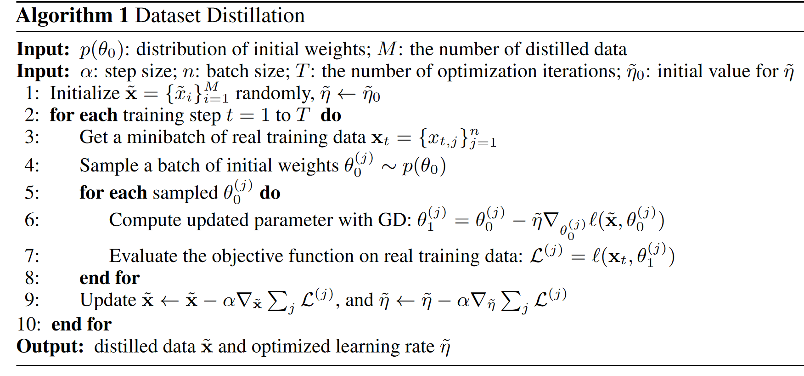

# Dataset Distillation

- [Dataset Distillation](#dataset-distillation)
- [What did the authors tried to accomplished?](#what-did-the-authors-tried-to-accomplished)
- [Key elements of the approach](#key-elements-of-the-approach)
  - [3.1 Optimise distilled data (for one initialisation)](#31-optimise-distilled-data-for-one-initialisation)
  - [3.2 Distillation for random initialisation](#32-distillation-for-random-initialisation)
  - [3.3 Analysis of simple linear case](#33-analysis-of-simple-linear-case)
  - [Algo](#algo)
  - [3.4 Multiple GD steps & epochs](#34-multiple-gd-steps--epochs)
  - [3.5 Distillation with different initilisation](#35-distillation-with-different-initilisation)
  - [Distillation with different objectives - data poisoning](#distillation-with-different-objectives---data-poisoning)
- [Results (Good or Bad)](#results-good-or-bad)
- [Other references to follow](#other-references-to-follow)
- [Observation & Takeaway](#observation--takeaway)
- [openreview](#openreview)

**Keywords**:
- Dataset Distillation (DC)
- Dataset pruning, core-set construction, and instance selection
- Gradient-based hyperparameter optimization
- Understanding datasets

**TLDR;**
- First paper explores the possibility of distillating images, inspired by Knowledge distillation
- Update sythetic data to udpate the model by treat model update as a function of data update (see [Algo](#algo))
- To improve the cross-architectures generalisation, it uses different initialisation to train
- It shows two applications: 
  1. adapting pre-trained models to new datasets with the distilled data 
  2. data-poisoning attack by training model with the distilled data with e.g. one step.

# What did the authors tried to accomplished?

**Main idea.**  compress the knowledge of an entire training dataset into a few **synthetic** training images & train a network to reach high performance with a **small number** of distilled images and **several** gradient descent steps.

**More** 
- adapting pre-trained models to new datasets and performing a malicious data-poisoning attack

**Previous problems.** 
- Dataset pruning, core-set construction, and instance selection. their “valuable” images have to be real  
  
**Motivation.** 
- network distillation (Hinton et al., 2015) - distill the knowledge of multiple networks into a single model
- Gradient-based Hyperparameter Optimization (Maclaurin et al., 2015) through Reversible Learning - focus on tuning hyperparameters 
   
# Key elements of the approach

In short:

1. derive the **network weights** as a **differentiable function** of our **synthetic** training **data**
2. instead of **optimizing** the **network weights** for a particular training objective, we optimize the pixel values of our **distilled images**

**outlines**
1. main **optimization** algorithm for training a network with a **fixed initialization** with one gradient descent (GD) step
2. **initial weights** are **random** rather than fixed
3. linear network case - understand both the property and limitation (lower bound on the size of distilled data)
4. more than one gradient descent steps and more than one epoch (pass)
5. demonstrate how to obtain distilled images with different initialization distributions and learning objectives

## 3.1 Optimise distilled data (for one initialisation)

From standard minibatch stochastic gradient descent 

$$
\begin{aligned}\theta_{t+1}&=\theta_t-\eta\nabla_{\theta_t}\ell(\textbf{x}_t,\theta_t),\end{aligned}
$$

(often takes tens of thousands or even millions of update steps to converge)

to 

$$
\theta_1=\theta_0-\tilde{\eta}\nabla_{\theta_0}\ell(\tilde{\textbf{x}},\theta_0)
$$

(derive the new **weights** $\theta_1$ as **a function of distilled data** $\tilde{x}$) 

to 

  

- **Aim**
  - learn a tiny set of synthetic distilled training data so that **a single GD step** like above using these learned synthetic data $\tilde{x}$ can greatly boost the performance on the real test set.
  - optimise $\theta_0$ same as optimise $\theta_1$

## 3.2 Distillation for random initialisation

- **Problem**
  - Previous one does not generalise well to other initialisation and thus the below is made.
- **Solution** 
  - form distilled images that work for networks with random initializations from **a specific distribution**
  - In practice, we observe that the final distilled data generalize well to **unseen initializations**
  - crucial for $l(x, ·)$ to share **similar local conditions** (e.g., output values, gradient magnitudes) over initializations  $\theta_0$ sampled from $p(\theta_0)$
  
$$
\tilde{\mathbf{x}}^{*},\tilde{\eta}^{*}=\underset{\tilde{\mathbf{x}},\tilde{\eta}}{\operatorname{arg}\operatorname{min}}\mathbb{E}_{\theta_0\sim p(\theta_0)}\mathcal{L}(\tilde{\mathbf{x}},\tilde{\eta};\theta_0)
$$

where the network initialization $\theta_0$ is randomly sampled from a distribution $p(\theta_0)$

## 3.3 Analysis of simple linear case

- The lower bound M ≥ D where M is the size of synthetic images and D is the dimension of the weigh
- This analysis motivates us to focus on p($\theta_0$) distributions that yield similar local conditions.
  
## Algo
**Steps**
1. Initialise synethic images randomly 
2. For each training steps
   1. sample from real data
   2. sample different network initialisation
   3. For each network
      1. update model param based on sythetic data
      2. update sythetic data based on model loss on real data

**Notes**
- optimised learning rate because ``optim.lr_scheduler.StepLR``
- **line 6** - **one step** gradient descent
  

  

## 3.4 Multiple GD steps & epochs

- To address the limitation of using a single GD step, they extend the method to **multiple GD steps**
- for each epoch, our method cycles through all GD steps, where each step is associated with a batch of distilled data (**before**: one step i.e. use one batch to update one initialisation and iterative until all batches - my understanding)

## 3.5 Distillation with different initilisation

Experiments with
- Random initialization
- Fixed initialization
- Random pre-trained weights
- Fixed pre-trained weights:

**Distillation with pre-trained weights.** 
- "Such learned distilled data essentially fine-tune weights pre-trained on one dataset to perform well for a new dataset"
- Adapt a model to another task / domain using the distilled data from the target dataset

## Distillation with different objectives - data poisoning

**Distillation for malicious data poisoning**. 
- a **single GD step** is applied with our synthetic adversarial data
- **Target attack** by distilling the knowledge of a specific category into data. 

$$
\tilde{\mathbf{x}}^{*}, \tilde{\eta}^{*}=\underset{\tilde{\mathbf{x}}, \tilde{\eta}}{\arg \min } \mathbb{E}_{\theta_0 \sim p\left(\theta_0\right)} \mathcal{L}_{K \rightarrow T}\left(\tilde{\mathbf{x}}, \tilde{\eta} ; \theta_0\right)
$$

# Results (Good or Bad)

- a handful of distilled images can be used to train a model with a fixed initialization to achieve surprisingly high performance
- **E.g.** possible to compress 60, 000 MNIST training images into just 10 synthetic distilled images (one per class) and achieve close to original performance with only a few gradient descent steps
- application
  - malicious data poisoning - For networks pre-trained on other tasks, our method can find distilled images for **fast model fine-tuning**
  - our method attacks the model training in one iteration and with only a few data

# Other references to follow

**code**
- https://github.com/SsnL/dataset-distillation

**More explanation**
- **Author**'s project site: https://www.tongzhouwang.info/dataset_distillation/

**openreview**
- ICLR2019 - https://openreview.net/forum?id=Sy4lojC9tm
- ICLR2020 - https://openreview.net/forum?id=ryxO3gBtPB

**papers**
- network distillation (Hinton et al., 2015)
- Geoffrey Hinton, Oriol Vinyals, and Jeff Dean. "**Distilling the Knowledge** in a Neural Network", in NIPS Deep Learning Workshop 2014.
- Dougal Maclaurin, David Duvenaud, and Ryan Adams. "**Gradient-based hyperparameter optimization** through reversible learning", in ICML 2015.
- Antonio Torralba and Alexei A Efros. "Unbiased look at dataset bias", in CVPR 2011.
- Agata Lapedriza, Hamed Pirsiavash, Zoya Bylinskii, and Antonio Torralba. "Are all training examples equally valuable?", in arXiv preprint 2013.

- Dataset pruning, core-set construction, and instance selection

**More papers**

- ensemble learning (Radosavovic et al., 2018)
- model compression (Ba & Caruana, 2014; Romero et al., 2015; Howard et al., 2017)
- data-free knowledge distillation 
  - optimizes synthetic data samples, but with a different objective of matching **activation statistics** of a teacher model in knowledge distillation (Lopes et al., 2017)

# Observation & Takeaway

**Observation**
- distilled data often look like random noise as it encodes the information of both training dataset x and a particular network initialization $\theta_0$

**Future work**

- extend our method to compressing **large-scale** visual datasets such as ImageNet and **other types** of data (e.g., audio and text)
- investigate other initialization strategies since **sensitive** to the **distribution of initializations**
- D**omain mismatch** and **dataset bias**

**Takeaway**
- Distillation with pre-trained weights

# openreview

**GD Steps and Epochs**
- Each step is associated with a different batch of distilled data. All steps are sequentially cycled over for #epochs times. We clarified this in Sec. 3.4.
  