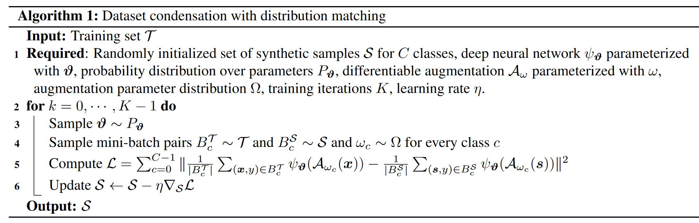

# Dataset Condensation with Distribution Matching

- [Dataset Condensation with Distribution Matching](#dataset-condensation-with-distribution-matching)
- [What did the authors tried to accomplished?](#what-did-the-authors-tried-to-accomplished)
  - [Algo](#algo)
- [Key elements of the approach](#key-elements-of-the-approach)
- [Results (Good or Bad)](#results-good-or-bad)
- [Other references to follow](#other-references-to-follow)
- [Takeaway](#takeaway)
- [Code Analysis](#code-analysis)
- [TODO](#todo)
- [More](#more)

**Keywords**:
- feature distribution matching
- expensive bi-level optimization

**TLDR**
- learn the synthetic data by minimizing the distribution discrepancy between real and synthetic data in these sampled **embedding spaces** (same model but different initialisation).
  - only optimizing S but no model parameters and thus avoids expensive bi-level optimization
  - existing formulations involve bi-level optimizations over network parameters θ and the synthetic data S

- contribution
  - work for **large scale** dataset e.g. tinyimagenet / imagenet-1k
  - **45 times faster** than the state-of-the-art for learning 50 images/class synthetic set on CIFAR10
    - tune only one hyper-parameter, i.e. learning rate for the synthetic images
    - first result that has neither **bi-level optimization** nor **second-order derivative** i.e. only optimizing $S$
  - independently run for each class **in parallel**
    - **distributedly** computed
  - more
    - family of embedding spaces can be efficiently obtained by sampling **randomly** **initialized** deep neural networks over different **pretrained** models

**Assumption**
- each training image x can be embedded into a lower dimensional space by using a family of parametric function


**openreview**

# What did the authors tried to accomplished?

**Main idea.**  Synthesize data that can accurately approximate the distribution of the real training data in a similar spirit to coreset techniques.

**Motivation.** Exsiting solutions involve expensive bi-level optimization or second-order derivative and does not scale.  

**Technqiues**:
- apply the differentiable Siamese augmentation
- treat each class separately
- 

## Algo

In words:
1. train the synthetic data for K iterations
   1. randomly sample the model $ψ$
   2. sample a pair of real and synthetic data batches & 
   3. augmentation parameter $ω_c$ ∼ $Ω$ for every class c
   4. mean discrepancy between the augmented real and synthetic batches of every class is calculated and then summed as **loss** $L$
   5. synthetic data S is updated by minimizing L with stochastic gradient descent and learning rate η

Notes
- mini-batch based training algorithm

<p align="center">
  
</p>

# Key elements of the approach

**Steps**.  
**Presudo code.**   

(from method)

# Results (Good or Bad)

- first result that has neither **bi-level optimization** nor **second-order derivative**
  - the synthetic data of different classes can be learned independently and **in parallel**.
- **45 times faster** than the state-of-the-art for learning **50 images/class** synthetic set on CIFAR10


# Other references to follow

(By category, from introduction, related work)

**More explanation**

**More papers**


# Takeaway

(what can be used in my part)

# Code Analysis

```py
embed = net.module.embed if torch.cuda.device_count() > 1 else net.embed # for GPU parallel
...
output_real = embed(img_real).detach()
output_syn = embed(img_syn)

loss += torch.sum((torch.mean(output_real, dim=0) - torch.mean(output_syn, dim=0))**2)
```

# TODO

1. summary
2. author / others explanation video / article
3. openreview
4. code

# More

Template based on:
- Stanford CS230: Deep Learning | Autumn 2018 | Lecture 8 - Career Advice / Reading Research Papers

**To understand better**
- openreview
- author's conference presentation
- youtube videos from other uni student
- reddit discussion
- twitter discussion