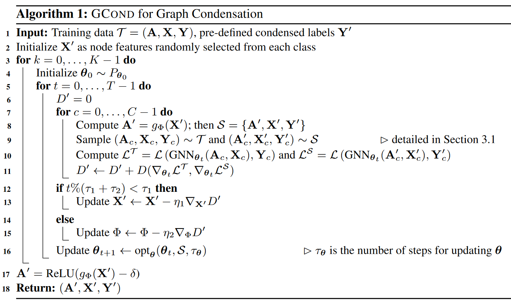

# Graph Condensation for GNN

- [Graph Condensation for GNN](#graph-condensation-for-gnn)
- [What did the authors tried to accomplished?](#what-did-the-authors-tried-to-accomplished)
- [Key elements of the approach](#key-elements-of-the-approach)
  - [Objective: Bi-level problem](#objective-bi-level-problem)
  - [Generalise to random initialisation](#generalise-to-random-initialisation)
  - [3.1 GRAPH CONDENSATION VIA GRADIENT MATCHING](#31-graph-condensation-via-gradient-matching)
    - [Parameter matching for GNNs - bypass the bi-level optimization](#parameter-matching-for-gnns---bypass-the-bi-level-optimization)
    - [one step gradient descent since multiple steps matching](#one-step-gradient-descent-since-multiple-steps-matching)
    - [Simplified formula - one step & small diff in real and synethic model parameter](#simplified-formula---one-step--small-diff-in-real-and-synethic-model-parameter)
    - [Distance formula](#distance-formula)
    - [What is learnt](#what-is-learnt)
  - [Graph Sampling - batch size](#graph-sampling---batch-size)
  - [3.2 Model Condensed Graph data](#32-model-condensed-graph-data)
    - [Model graph as a function of node features](#model-graph-as-a-function-of-node-features)
- [Takeaway](#takeaway)
- [Other references to follow](#other-references-to-follow)
- [Results (Good or Bad)](#results-good-or-bad)

**Keywords**:
- Dataset Distillation (DC), Dataset condensation (DC)
- GNNs
- Graph Sampling

**TLDR;**
- Adapt DD & DC to graph setting
- distillation method part is very similar to DC paper except for the formulation of graph setting i.e. what is learnt

# What did the authors tried to accomplished?

Aims to minimize the performance gap between GNN models trained on a synthetic, simplified graph and the original training graph.  
  

# Key elements of the approach

1. formulate the objective for graph condensation tractable for learning
2. how to parameterize the to-be-learned node features and graph structure
   - strategy of parameterizing the condensed features as free parameters and model the synthetic graph structure as a function of features

## Objective: Bi-level problem  
i.e. minimise the model's loss on the original dataset and select the optimal parameters that minimise the loss on sythetic dataset

$$
\underset{\mathcal{S}}{\text{min}}\mathcal{L}(\text{GNN}_{\boldsymbol{\theta}_{\mathcal{S}}}(\mathbf{A},\mathbf{X}),\mathbf{Y})\quad\text{s.t}\quad\boldsymbol{\theta}_{\mathcal{S}}=\underset{\boldsymbol{\theta}}{\text{arg}\text{min}}\mathcal{L}(\text{GNN}_{\boldsymbol{\theta}}(\mathbf{A}',\mathbf{X}'),\mathbf{Y}')
$$  

## Generalise to random initialisation

- To avoid **overfitting** on a specific model initialization:
- To learn synthetic graphs that **generalize** to a distribution of model parameters $P\_{\boldsymbol{\theta}\_0}$ , we sample $\boldsymbol{\theta}\_{0}\sim P\_{\boldsymbol{\theta}\_{0}}$.
- for **inductive learning** where all the nodes are labeled and test nodes are unseen during training.
- easily generalize graph condensation to **transductive setting** by assuming Y is partially labeled.

$$
\min _{\mathcal{S}} \mathrm{E}_{\boldsymbol{\theta}_0 \sim P_{\theta_0}}\left[\mathcal{L}\left(\operatorname{GNN}_{\boldsymbol{\theta}_{\mathcal{S}}}(\mathbf{A}, \mathbf{X}), \mathbf{Y}\right)\right] \quad \text { s.t. } \quad \boldsymbol{\theta}_{\mathcal{S}}=\underset{\boldsymbol{\theta}}{\arg \min } \mathcal{L}\left(\operatorname{GNN}_{\boldsymbol{\theta}\left(\boldsymbol{\theta}_0\right)}\left(\mathbf{A}^{\prime}, \mathbf{X}^{\prime}\right), \mathbf{Y}^{\prime}\right)
$$

## 3.1 GRAPH CONDENSATION VIA GRADIENT MATCHING

### Parameter matching for GNNs - bypass the bi-level optimization 

- inspired by DC
- matching their gradients at each training step
- **Aim**
  - similar training trajectory in the parameter space
  - models trained on these two datasets converge to similar solutions (parameters)

$$
\begin{gathered}
\min _{\mathcal{S}} \mathrm{E}_{\boldsymbol{\theta}_0 \sim P_{\boldsymbol{\theta}_0}}\left[\sum_{t=0}^{T-1} D\left(\boldsymbol{\theta}_t^{\mathcal{S}}, \boldsymbol{\theta}_t^{\mathcal{T}}\right)\right] \quad \text { with } \\
\boldsymbol{\theta}_{t+1}^{\mathcal{S}}=\operatorname{opt}_{\boldsymbol{\theta}}\left(\mathcal{L}\left(\operatorname{GNN}_{\boldsymbol{\theta}_t^{\mathcal{S}}}\left(\mathbf{A}^{\prime}, \mathbf{X}^{\prime}\right), \mathbf{Y}^{\prime}\right)\right) \text { and } \boldsymbol{\theta}_{t+1}^{\mathcal{T}}=\operatorname{opt}_{\boldsymbol{\theta}}\left(\mathcal{L}\left(\operatorname{GNN}_{\boldsymbol{\theta}_t^{\mathcal{T}}}(\mathbf{A}, \mathbf{X}), \mathbf{Y}\right)\right)
\end{gathered}
$$

### one step gradient descent since multiple steps matching

-  **Motivation.** Since our goal is to match the parameters step by step

$$
\boldsymbol{\theta}_{t+1}^{\mathcal{S}} \leftarrow \boldsymbol{\theta}_t^{\mathcal{S}}-\eta \nabla_{\boldsymbol{\theta}} \mathcal{L}\left(\mathrm{GNN}_{\boldsymbol{\theta}_t^S}\left(\mathbf{A}^{\prime}, \mathbf{X}^{\prime}\right), \mathbf{Y}^{\prime}\right) \quad \text { and } \quad \boldsymbol{\theta}_{t+1}^{\mathcal{T}} \leftarrow \boldsymbol{\theta}_t^{\mathcal{T}}-\eta \nabla_{\boldsymbol{\theta}} \mathcal{L}\left(\mathrm{GNN}_{\boldsymbol{\theta}_t^T}(\mathbf{A}, \mathbf{X}), \mathbf{Y}\right)
$$

### Simplified formula - one step & small diff in real and synethic model parameter

(since expensive), we match the parameter gradient instead $D(\boldsymbol{\theta}\_{t}^{\mathcal S},\boldsymbol{\theta}\_{t}^{\mathcal T})$ , $D$ is the distinace formula e.g. cosine simarily.

- Based on the observation made in Zhao et al. (2021) that the distance between $\boldsymbol{\theta}_{t}^{\mathcal{S}}$  and  $\boldsymbol{\theta}_{t}^{\mathcal{T}}$  is typically small
  - $\boldsymbol{\theta}_{t}^{\mathcal{S}}$  and  $\boldsymbol{\theta}_{t}^{\mathcal{T}}$ is replaced by $\boldsymbol{\theta}_{t}$
- Loss is replaced by the gradient $\nabla_{\boldsymbol{\theta}}$ since one step 
  
$$
\underset{S}{\operatorname*{min}}\operatorname{E}_{\boldsymbol{\theta}_{0}\sim P_{\boldsymbol{\theta}_{0}}}\left[\sum_{t=0}^{T-1}D\left(\nabla_{\boldsymbol{\theta}}\mathcal{L}\left(\operatorname{GNN}_{\boldsymbol{\theta}_{t}}(\mathbf{A}',\mathbf{X}^{\prime}),\mathbf{Y}^{\prime}\right),\nabla_{\boldsymbol{\theta}}\mathcal{L}\left(\operatorname{GNN}_{\boldsymbol{\theta}_{t}}(\mathbf{A},\mathbf{X}),\mathbf{Y}\right)\right)\right]
$$

### Distance formula

- The distance D is further defined as the sum of the distance dis at each layer

$$
\begin{aligned}dis(\textbf{G}^S,\textbf{G}^\mathcal{T})=\sum\limits_{i=1}^{d_2}\left(1-\frac{\textbf{G}_\textbf{i}^S\cdot\textbf{G}_\textbf{i}^\mathcal{T}}{\left\|\textbf{G}_\textbf{i}^S\right\|\left\|\textbf{G}_\textbf{i}^T\right\|}\right)\end{aligned}
$$

### What is learnt 

- jointly learning the three variables **A′, X′ and Y′** is highly challenging, as they are interdependent. 
- Hence, to simplify the problem, we **fix the node labels Y′** while keeping the class distribution the same as the original labels Y.

## Graph Sampling - batch size

- **Motivation.**
  - **large batch size** tends to make reconstruction more difficult because more variables are involved during optimization
  - the **computation cost** of GNNs gets expensive on large graphs as the forward pass of GNNs involves the aggregation of enormous neighboring nodes
  - GNNs are often trained in a **full-batch** manner
- **solutions.**
  - mini-batch training strategy

## 3.2 Model Condensed Graph data

### Model graph as a function of node features  

1\) so that the correlation between the graph and node features are also modelled, rather treating them independently. 2) avoiding jointly learning $O(N^2)$ parameters - less risk of overfitting as $N'$ gets larger.  

$$
\mathbf{A}'=g_{\Phi}(\mathbf{X}'),\quad\text{with A}'_{ij}=\mathbf{Sigmod}\left(\dfrac{\mathbf{ML}\mathbf{P}_{\Phi}([\mathbf{x}'_i;\mathbf{x}'_j])+\mathbf{M}\mathbf{L}\mathbf{P}_{\Phi}([\mathbf{x}'_j;\mathbf{x}'_i])}{2}\right)
$$  

$$
\operatorname*{min}_{\mathbf{X}^{\prime},\Phi}\operatorname{E}_{\boldsymbol{\theta}_{0}\sim P_{\theta_{0}}}\left[\sum_{t=0}^{T-1}D\left(\nabla_{\boldsymbol{\theta}}\mathcal{L}\left(\mathrm{GNN}_{\boldsymbol{\theta}},(g_{\boldsymbol{\Phi}}(\mathbf{X}^{\prime}),\mathbf{X}^{\prime}),\mathbf{Y}^{\prime}\right),\mathbf{\nabla}_{\boldsymbol{\theta}}\mathcal{L}\left(\mathrm{GNN}_{\boldsymbol{\theta}_{t}}(\mathbf{A},\mathbf{X}),\mathbf{Y}\right)\right)\right]
$$

# Takeaway

- gradient matching loss as the condensation objective
- strategy of parameterizing the condensed features as free parameters and model the synthetic graph structure as a function of features, which takes advantage of the implicit relationship between structure and node features, consumes less number of parameters and offers better performance

Training

- **Alternating Optimization Schema.** Jointly optimizing X′ and Φ is often challenging as they are directly affecting each other  
- **Sparsification.** remove the entries whose values are smaller than a given threshold

Variant

- **A “Graphless” Model Variant.**

More 

- as suggested by previous works that reconstruct data from gradients (Zhu et al., 2019), **large batch size** tends to make reconstruction more difficult because more variables are involved during optimization
- sample a fixed-size set of neighbors on the original graph in each aggregation layer of GNNs and adopt a mini-batch training strategy because forward pass of GNNs involves the aggregation of enormous neighboring nodes i.e. **expensive**
- calculate the gradient matching loss for nodes from different classes separately to further **reduce memory usage and ease optimization**
- treating **A′ and X′ as independent** parameters overlooks the implicit correlations between graph structure and features

**Remarks.** For the gradient matching method part, very similar to GC paper & Less detailed compare to the DC paper.

# Other references to follow

1. dataset distillation (Wang et al., 2018)
2. dataset condensation (Zhao et al., 2021) 
3. gradient matching scheme (Zhao et al., 2021)

baselines

1. graph coarsening method (Loukas, 2019; Huang et al., 2021b)
2. three coreset methods (Random, Herding (Welling, 2009)
3. K-Center (Farahani & Hekmatfar, 2009; Sener & Savarese, 2018))

# Results (Good or Bad)

- Approximate the original test accuracy by 95.3% on Reddit, 99.8% on Flickr and 99.0% on Citeseer, while reducing their graph size by more than 99.9%.
- consistently outperforms coarsening, coreset and dataset condensation baselines
- reliable correlation of performances between condensed dataset training and whole-dataset training