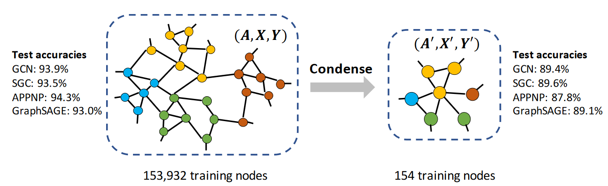

# Graph Condensation for GNN

- [Graph Condensation for GNN](#graph-condensation-for-gnn)
- [What did the authors tried to accomplished?](#what-did-the-authors-tried-to-accomplished)
- [Key elements of the approach](#key-elements-of-the-approach)
  - [Objective: Bi-level problem](#objective-bi-level-problem)
  - [Generalise to random initialisation](#generalise-to-random-initialisation)
  - [3.1 GRAPH CONDENSATION VIA GRADIENT MATCHING](#31-graph-condensation-via-gradient-matching)
    - [Parameter matching for GNNs - bypass the bi-level optimization](#parameter-matching-for-gnns---bypass-the-bi-level-optimization)
    - [one step gradient descent since multiple steps matching](#one-step-gradient-descent-since-multiple-steps-matching)
    - [Simplified formula - one step & small diff in real and synethic model parameter](#simplified-formula---one-step--small-diff-in-real-and-synethic-model-parameter)
    - [Distance formula](#distance-formula)
    - [What is learnt](#what-is-learnt)
  - [Graph Sampling - batch size](#graph-sampling---batch-size)
  - [3.2 Model Condensed Graph data](#32-model-condensed-graph-data)
    - [Model graph as a function of node features](#model-graph-as-a-function-of-node-features)
  - [Tricks](#tricks)
  - [“Graphless” Model Variant - GCOND-X](#graphless-model-variant---gcond-x)
  - [Algo](#algo)
- [Takeaway](#takeaway)
- [Other references to follow](#other-references-to-follow)
- [Results (Good or Bad)](#results-good-or-bad)
- [More](#more)
  - [Openreview](#openreview)
  - [More investigation](#more-investigation)
  - [Notations](#notations)
  - [my questions](#my-questions)

**Keywords**:
- Dataset Distillation (DC), Dataset condensation (DC)
- GNNs
- Graph Sampling

**TLDR;**
- Adapt DD & DC to graph setting
  - Technically, the overall framework follows the **gradient matching** method, but specific **parameterization** is proposed for optimizing the small synthetic graph.
- different to image setting
  1. batch of **node features** over images
  2. **MLP model** (model graph structure (adjacency matrix) as a function of node features)
- contribution
  - develop tricks that is unique in the graph domain
    - **Modeling the dependencies** between nodes. by parameterization of graph structure as node features
    - **optimization** scheme
      - training the graph structure and node features alternatively
    - **sampling** strategies
    - **sparsification** strategy. remove low value entries 

  

**openreview**
- The authors claim that it is important to parameterize A' as a function of X'. However, experiments are not conducted to support this very important claim.

# What did the authors tried to accomplished?

- Aims to minimize the performance gap between GNN models trained on a synthetic, simplified graph and the original training graph.  
- Graph setting different to image setting
  - two more variables: **node features** and graph structure i.e. **adjacency matrix**
  - since structure is model as a function of node features
    - two variables becomes the **model** & **node features**
  
**Motivation.** DD & DC.

# Key elements of the approach

1. formulate the objective for graph condensation tractable for learning
2. how to parameterize the to-be-learned node features and graph structure
   - strategy of parameterizing the condensed features as free parameters and model the synthetic graph structure as a function of features

## Objective: Bi-level problem  

- learn a small, synthetic graph dataset such that a GNN trained on S can achieve comparable performance to one trained on the much larger T 

$$
\underset{\mathcal{S}}{\text{min}}\mathcal{L}(\text{GNN}_{\boldsymbol{\theta}_{\mathcal{S}}}(\mathbf{A},\mathbf{X}),\mathbf{Y})\quad\text{s.t}\quad\boldsymbol{\theta}_{\mathcal{S}}=\underset{\boldsymbol{\theta}}{\text{arg}\text{min}}\mathcal{L}(\text{GNN}_{\boldsymbol{\theta}}(\mathbf{A}',\mathbf{X}'),\mathbf{Y}')
$$  

## Generalise to random initialisation

- To avoid **overfitting** on a specific model initialization:
- To learn synthetic graphs that **generalize** to a distribution of model parameters $P\_{\boldsymbol{\theta}\_0}$ , we sample $\boldsymbol{\theta}\_{0}\sim P\_{\boldsymbol{\theta}\_{0}}$.
- for **inductive learning** where all the nodes are labeled and test nodes are unseen during training.
- easily generalize graph condensation to **transductive setting** by assuming Y is partially labeled.

$$
\min _{\mathcal{S}} \mathrm{E}_{\boldsymbol{\theta}_0 \sim P_{\theta_0}}\left[\mathcal{L}\left(\operatorname{GNN}_{\boldsymbol{\theta}_{\mathcal{S}}}(\mathbf{A}, \mathbf{X}), \mathbf{Y}\right)\right] \quad \text { s.t. } \quad \boldsymbol{\theta}_{\mathcal{S}}=\underset{\boldsymbol{\theta}}{\arg \min } \mathcal{L}\left(\operatorname{GNN}_{\boldsymbol{\theta}\left(\boldsymbol{\theta}_0\right)}\left(\mathbf{A}^{\prime}, \mathbf{X}^{\prime}\right), \mathbf{Y}^{\prime}\right)
$$

## 3.1 GRAPH CONDENSATION VIA GRADIENT MATCHING

### Parameter matching for GNNs - bypass the bi-level optimization 

- inspired by DC
- matching their gradients at each training step
- **Aim**
  - similar training trajectory in the parameter space
  - models trained on these two datasets converge to similar solutions (parameters)

$$
\begin{gathered}
\min _{\mathcal{S}} \mathrm{E}_{\boldsymbol{\theta}_0 \sim P_{\boldsymbol{\theta}_0}}\left[\sum_{t=0}^{T-1} D\left(\boldsymbol{\theta}_t^{\mathcal{S}}, \boldsymbol{\theta}_t^{\mathcal{T}}\right)\right] \quad \text { with } \\
\boldsymbol{\theta}_{t+1}^{\mathcal{S}}=\operatorname{opt}_{\boldsymbol{\theta}}\left(\mathcal{L}\left(\operatorname{GNN}_{\boldsymbol{\theta}_t^{\mathcal{S}}}\left(\mathbf{A}^{\prime}, \mathbf{X}^{\prime}\right), \mathbf{Y}^{\prime}\right)\right) \text { and } \boldsymbol{\theta}_{t+1}^{\mathcal{T}}=\operatorname{opt}_{\boldsymbol{\theta}}\left(\mathcal{L}\left(\operatorname{GNN}_{\boldsymbol{\theta}_t^{\mathcal{T}}}(\mathbf{A}, \mathbf{X}), \mathbf{Y}\right)\right)
\end{gathered}
$$

### one step gradient descent since multiple steps matching

-  **Motivation.** Since our goal is to match the parameters step by step

$$
\boldsymbol{\theta}_{t+1}^{\mathcal{S}} \leftarrow \boldsymbol{\theta}_t^{\mathcal{S}}-\eta \nabla_{\boldsymbol{\theta}} \mathcal{L}\left(\mathrm{GNN}_{\boldsymbol{\theta}_t^S}\left(\mathbf{A}^{\prime}, \mathbf{X}^{\prime}\right), \mathbf{Y}^{\prime}\right) \quad \text { and } \quad \boldsymbol{\theta}_{t+1}^{\mathcal{T}} \leftarrow \boldsymbol{\theta}_t^{\mathcal{T}}-\eta \nabla_{\boldsymbol{\theta}} \mathcal{L}\left(\mathrm{GNN}_{\boldsymbol{\theta}_t^T}(\mathbf{A}, \mathbf{X}), \mathbf{Y}\right)
$$

### Simplified formula - one step & small diff in real and synethic model parameter

(since expensive), we match the parameter gradient instead $D(\boldsymbol{\theta}\_{t}^{\mathcal S},\boldsymbol{\theta}\_{t}^{\mathcal T})$ , $D$ is the distinace formula e.g. cosine simarily.

- Based on the observation made in Zhao et al. (2021) that the distance between $\boldsymbol{\theta}_{t}^{\mathcal{S}}$  and  $\boldsymbol{\theta}_{t}^{\mathcal{T}}$  is typically small
  - $\boldsymbol{\theta}_{t}^{\mathcal{S}}$  and  $\boldsymbol{\theta}_{t}^{\mathcal{T}}$ is replaced by $\boldsymbol{\theta}_{t}$
- Loss is replaced by the gradient $\nabla_{\boldsymbol{\theta}}$ since one step 
  
$$
\underset{S}{\operatorname*{min}}\operatorname{E}_{\boldsymbol{\theta}_{0}\sim P_{\boldsymbol{\theta}_{0}}}\left[\sum_{t=0}^{T-1}D\left(\nabla_{\boldsymbol{\theta}}\mathcal{L}\left(\operatorname{GNN}_{\boldsymbol{\theta}_{t}}(\mathbf{A}',\mathbf{X}^{\prime}),\mathbf{Y}^{\prime}\right),\nabla_{\boldsymbol{\theta}}\mathcal{L}\left(\operatorname{GNN}_{\boldsymbol{\theta}_{t}}(\mathbf{A},\mathbf{X}),\mathbf{Y}\right)\right)\right]
$$

### Distance formula

- The distance D is further defined as the sum of the distance dis at each layer

$$
\begin{aligned}dis(\textbf{G}^S,\textbf{G}^\mathcal{T})=\sum\limits_{i=1}^{d_2}\left(1-\frac{\textbf{G}_\textbf{i}^S\cdot\textbf{G}_\textbf{i}^\mathcal{T}}{\left\|\textbf{G}_\textbf{i}^S\right\|\left\|\textbf{G}_\textbf{i}^T\right\|}\right)\end{aligned}
$$

### What is learnt 

- jointly learning the three variables **A′, X′ and Y′** is highly challenging, as they are interdependent. 
- Hence, to simplify the problem, we **fix the node labels Y′** while keeping the class distribution the same as the original labels Y.

## Graph Sampling - batch size

- **Motivation.**
  - **large batch size** tends to make reconstruction more difficult because more variables are involved during optimization
  - the **computation cost** of GNNs gets expensive on large graphs as the forward pass of GNNs involves the aggregation of enormous neighboring nodes
  - GNNs are often trained in a **full-batch** manner
- **solutions.**
  - mini-batch training strategy
  - sample a fixed-size set of neighbors on the original graph in each aggregation layer of GNNs

## 3.2 Model Condensed Graph data

- **model** the condensed **graph** data and resolve **dependency** among nodes
- Method 1 (straightforward)
  - treat both A′ and X′ as free parameters 
  - cons
    - increased model complexity
      - number of parameters in A′ grows quadratically as N ′ increases.
    - treat them independent overlooks the implicit **correlations** between **graph structure** and **features** (**ref**)
  - takeaway
    - **parametrize** the condensed **adjacency matrix** in a way where the number of **parameters** **does not grow too fast**

### Model graph as a function of node features 

Formula
- intentionally control $\textbf{A}'\_{ij}=\textbf{A}'\_{ji}$ to make the condensed graph structure **symmetric** since we are mostly dealing with symmetric graphs
- adjust to asymmetric graphs by setting $\begin{aligned}\mathbf{A}'\_{ij}=\mathop{\textrm{Sigmod}}(\mathop{\textrm{MLP}}\_{\Phi}([\mathbf{x}\_i;\mathbf{x}\_j'])\end{aligned}$

$$
\mathbf{A}'=g_{\Phi}(\mathbf{X}'),\quad\text{with A}'_{ij}=\mathbf{Sigmod}\left(\dfrac{\mathbf{ML}\mathbf{P}_{\Phi}([\mathbf{x}'_i;\mathbf{x}'_j])+\mathbf{M}\mathbf{L}\mathbf{P}_{\Phi}([\mathbf{x}'_j;\mathbf{x}'_i])}{2}\right)
$$  

**Objective function**:

- pros
  - the number of **parameters** for modeling graph structure no longer depends on the number of **nodes**
    - avoiding jointly learning $O(N^2)$ parameters (i.e. the graph structure adjacency matrix) - less risk of overfitting as $N'$ gets larger.  
    - number of parameters for modeling graph structure no longer depends on the **number of nodes** (but the node features)
  - **grow** the synthetic graph by adding more synthetic nodes condensed from real graph
    - only need to learn their features
    - the trained MLPΦ can be employed to **infer the connections** of new synthetic nodes
  
Formula

$$
\operatorname*{min}_{\mathbf{X}^{\prime},\Phi}\operatorname{E}_{\boldsymbol{\theta}_{0}\sim P_{\theta_{0}}}\left[\sum_{t=0}^{T-1}D\left(\nabla_{\boldsymbol{\theta}}\mathcal{L}\left(\mathrm{GNN}_{\boldsymbol{\theta}},(g_{\boldsymbol{\Phi}}(\mathbf{X}^{\prime}),\mathbf{X}^{\prime}),\mathbf{Y}^{\prime}\right),\mathbf{\nabla}_{\boldsymbol{\theta}}\mathcal{L}\left(\mathrm{GNN}_{\boldsymbol{\theta}_{t}}(\mathbf{A},\mathbf{X}),\mathbf{Y}\right)\right)\right]
$$

## Tricks

- Alternating Optimization Schema
  - **Motivation.** Jointly optimizing X′ and Φ is often challenging as they are directly affecting each other
  - alternatively optimize X′ and Φ: we update Φ for the first τ1 epochs and then update X′ for τ2 epochs; then repeat until crition met
  - pros
    -  resembles the real scenarios where node features affect the connectivities and then the connectivities also affect the node features in turn

- Sparsification
  - remove small value entries less than threshold $δ$ in the adjacency matrix 
    - the learned condensed adjacency matrix A′ may have small values which have **little effect** on the aggregation process in GNNs but **cost storage** (e.g. 4 bytes per float)
  - promote sparsity of the learned A′
    - do not degrade performance a lot
  - use A′ = ReLU(gΦ(X′) − δ) to obtain the final **sparsified graph structure**

## “Graphless” Model Variant - GCOND-X

- only learns the condensed node features X′ without learning the condensed structure A′
- use a fixed identity matrix I as the condensed graph structure
- **Aim.** match the gradients of GNN parameters on the large-real data $(A, X)$ and small-synthetic data $(I, X′)$

Table
- DC-Graph shows difference in **condensation** using with / without graph  
- GCOND-X shows the  difference in **training** with / without graph

$$
\begin{array}{lllll}
\hline & \text { DC } & \text { DC-Graph } & \text { GCoND-X } & \text { GCoND } \\
\hline \text { Condensation } & \mathbf{X}_{\text {train }} & \mathbf{X}_{\text {train }} & \mathbf{A}_{\text {train }}, \mathbf{X}_{\text {train }} & \mathbf{A}_{\text {train }}, \mathbf{X}_{\text {train }} \\
\hline \text { Training } & \mathbf{X}^{\prime} & \mathbf{X}^{\prime} & \mathbf{X}^{\prime} & \mathbf{A}^{\prime}, \mathbf{X}^{\prime} \\
\text { Test } & \mathbf{X}_{\text {test }} & \mathbf{A}_{\text {test }}, \mathbf{X}_{\text {test }} & \mathbf{A}_{\text {test }}, \mathbf{X}_{\text {test }} & \mathbf{A}_{\text {test }}, \mathbf{X}_{\text {test }} \\
\hline
\end{array}
$$

## Algo 

- TODO

# Takeaway

- gradient matching loss as the condensation objective
- strategy of parameterizing the condensed features as free parameters and model the synthetic graph structure as a function of features, which takes advantage of the implicit relationship between structure and node features, consumes less number of parameters and offers better performance

Training

- **Alternating Optimization Schema.** Jointly optimizing X′ and Φ is often challenging as they are directly affecting each other  
- **Sparsification.** remove the entries whose values are smaller than a given threshold

Variant

- **A “Graphless” Model Variant.**

More 

- as suggested by previous works that reconstruct data from gradients (Zhu et al., 2019), **large batch size** tends to make reconstruction more difficult because more variables are involved during optimization
- sample a fixed-size set of neighbors on the original graph in each aggregation layer of GNNs and adopt a mini-batch training strategy because forward pass of GNNs involves the aggregation of enormous neighboring nodes i.e. **expensive**
- calculate the gradient matching loss for nodes from different classes separately to further **reduce memory usage and ease optimization**
- treating **A′ and X′ as independent** parameters overlooks the implicit correlations between graph structure and features

**Remarks.** For the gradient matching method part, very similar to GC paper & Less detailed compare to the DC paper.

# Other references to follow

1. dataset distillation (Wang et al., 2018)
2. dataset condensation (Zhao et al., 2021) 
3. gradient matching scheme (Zhao et al., 2021)

openreview - https://openreview.net/forum?id=WLEx3Jo4QaB

baselines

1. graph coarsening method (Loukas, 2019; Huang et al., 2021b)
2. three coreset methods (Random, Herding (Welling, 2009)
3. K-Center (Farahani & Hekmatfar, 2009; Sener & Savarese, 2018))

# Results (Good or Bad)

- Approximate the original test accuracy by 95.3% on Reddit, 99.8% on Flickr and 99.0% on Citeseer, while reducing their graph size by more than 99.9%.
- consistently outperforms coarsening, coreset and dataset condensation baselines
- reliable correlation of performances between condensed dataset training and whole-dataset training

# More

## Openreview

- What if A' and X' are treated as **free parameters**? What if A' is independent of X'? For example, we can set 
 where  is a free parameter to replace equation (7). What's the performance of this approach, in terms of both the optimization efficiency and the test performance?
  - show more stable performance and significantly improves the performance compare to learning independetly

- **deeper** GNN result comparison
  - poor result as the layers number increase, they conjecture that when we stack more GNN layers, more nodes are involved during the forward process, and this makes the optimization of condensed graph more difficult. 

-  $\theta_t$ in Section 3.1 clarification
   -   apply the same GNN on both the synthetic, condensed graph and the original, real graph

- Time complexity of the condensation process
  - around 2.4 hours - The whole condensation process (1000 epochs) for generating 0.5% condensed graph of Ogbn-arxiv 
    -  one single A100-SXM4 GPU

- In Section 3.2, the authors claim that GCond-X, which only learns the condensed node features X' and not the condensed graph structure A', also performs well. This observation leads me to wonder if the proposed method is better suited for **dataset condensation** rather than **graph condensation**.

## More investigation

- It may reveal insights into **interpretability** and the nature of **sample-efficient representations**. For example, as shown in Table 5 and Figure 2, the condensed graph provides a plausible interpretation of the original dataset and in some cases it preserves the **homophily property** of the original dataset, though not always.
- Understanding the importance of **preserving** these **properties** (or good performance albeit not preserving them) is an interesting area of further research.
- neural architecture search (NAS) and continual learning
  - observe reliable correlation of performances between condensed dataset training and whole-dataset training

## Notations

- $\mathcal{T}=\{\textbf{A},\textbf{X},\textbf{Y}\}$ - graph dataset 
- $\textbf{A}$ - adjacency matrix
- $\textbf{N}$ - number of nodes
- $\mathcal S=\{\textbf A',\textbf X',\textbf Y'\}$ - synthetic graph dataset
- $δ$ - sparsification threshold 

## my questions

-  the number of parameters does not grow quadratically with the number of condensed nodes, why?
   -  model graph i.e. adjacency matrix is of complexity $n^2$