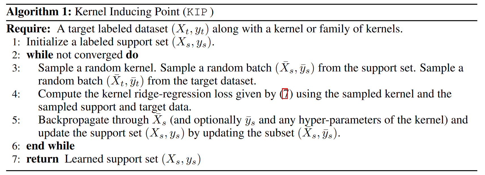

# KIP-FC - Dataset meta-learning from kernel ridge-regression;

- [KIP-FC - Dataset meta-learning from kernel ridge-regression;](#kip-fc---dataset-meta-learning-from-kernel-ridge-regression)
- [What did the authors tried to accomplished?](#what-did-the-authors-tried-to-accomplished)
  - [Algo](#algo)
  - [KIP variation](#kip-variation)
  - [Label solving (LS)](#label-solving-ls)
- [Key elements of the approach](#key-elements-of-the-approach)
- [Results (Good or Bad)](#results-good-or-bad)
- [References](#references)
- [Code Analysis](#code-analysis)
- [TODO](#todo)
- [Openreview](#openreview)
  - [cons](#cons)
  - [more](#more)
- [More](#more-1)

**Keywords**:
- meta-learning, first-order meta-learning algorithm **KIP (Kernel Inducing Points)**
- correspondence between infinitely-wide neural networks and kernel ridge-regression (KRR)
- **2 Applications**: Sample efficiency / compression, Privacy guarantee

**TLDR**
(my summary of the paper)

- contribution
  - concept of $\epsilon$-approximation of a dataset
    - theoretical framework for understanding dataset distillation and compression
  - establish convergence in the case of a **linear kernel**
  - a variant called **Label Solve (LS )**, which gives a closed-form solution for obtaining distilled datasets differing only via labels
  - shows that kernel learnt data
    - **transferable** 
      - to the training of finite-width **neural networks**
      - investigated by in unison via **neural tangent kernels**
    - **Privacy**
      - up to 90% of their pixels corrupted with limited degradation in performance

**openreview**

- Other's summary

**Takeaway**

(what can be used in my part)

# What did the authors tried to accomplished?

**Main idea.**  TODO  
**Motivation.** TODO  
**Previous problems.** TODO  

## Algo

- very similar to DD & DC but replace NN with kernel

  

## KIP variation

- randomly **augment** the sampled target batches in KIP
- create highly corrupted datasets
  - choose a corruption fraction
  - corruption scheme (zero out all such pixels or initialize with noise)
  - do not update such corrupted coordinate

## Label solving (LS)

- find the minimum of (7) with respect to the support labels while holding Xs fixed

# Key elements of the approach

**Steps**.  
**Presudo code.**   

(from method)

# Results (Good or Bad)

(from conclusion)

# References

- code - https://colab.research.google.com/github/google-research/google-research/blob/master/kip/KIP.ipynb
- openreview 
  - https://openreview.net/forum?id=l-PrrQrK0QR

**More explanation**

**More papers**

# Code Analysis

(main file logic and key implementation details)

# TODO

1. summary
2. author / others explanation video / article
3. openreview
4. code

# Openreview

## cons 

- On the usage of deep kernel learning to do data distillation, the idea has been explored too (Snelson & Ghahramani, 2006) but the authors took it a bit further with the LS algorithm and the privacy preservation aspect

## more

why called meta learning?

- we regard our method as meta-learning due to our bi-level optimization (Section 3 of the current version) where the **inner** optimization is by the **KRR solver** and the **outer** optimization is **learning the support set** fed into the KRR solver. Each update to the support set is thus one meta-update episode. While we agree that conventional meta-learning involves learning over multiple datasets, we believe the term is used more broadly nowadays and covers our setup

# More

**kernel.** 