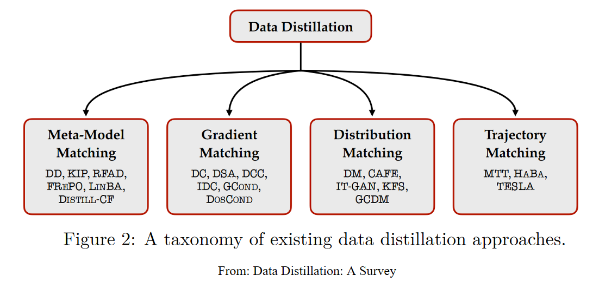

  

  

   

  

TOC

- [My Reading List](#my-reading-list)
- [Data Distillation](#data-distillation)
- [Graph Distillation](#graph-distillation)
  - [Recommender System](#recommender-system)
- [Survey - data distillation](#survey---data-distillation)
- [Links](#links)
- [Inbox](#inbox)
- [Authors](#authors)
  
# My Reading List

status

    💯 | fully read  
    ✅ | Read & Summarised (can skim experiment & supplement)  
    ❎ | Read & not fully summarised    
    ☑️ | Reading  
    🔲 | TO READ  

Note
- Paper file is named by "id-title-reference"
- Add submitted date if different to conference year
- Paper list ordered by APA reference date

| Title | Authors | Date | status | Description | Comments |

# Data Distillation

* [DD - Dataset Distillation](DD%20-%20dataset%20distillation%20(Wang,%202018.11).md) ; Tongzhou Wang ; 2018 ; ✅ ; First formal DD paper, inspired by KD, Bi-level Opt;
  
* [DC - Dataset Condensation with gradient matching](DC%20-%20dataset%20condensation%20(Zhao,%202020.6).md); Bo Zhao ;2020, ICLR 2021 ; ✅ ; Improve DD with Gradient surrogate objective (faster, efficient) ;
  
* [DSA - Dataset Condensation with Differentiable Siamese Augmentation](DSA%20-%20data%20augmentation%20(Zhao,%202021).md); Bo Zhao ; 2021, ICML 2021 ; ❎ ; Improve DC with data augmentation techniques tailored to sythetic data, Traditional ones give poor performance gain ; 

* [DM - Dataset Condensation with Distribution Matching](DM%20-%20distribution%20matching%20(Zhao%20&%20Bilen,%202021.10).md);  Bo Zhao ; 2021, WACV 2023  ; ❎ ; Objective: embedding space dist matching; Fast;

* [KIP-FC - Dataset meta-learning from kernel ridge-regression](); Timothy Nguyen ; ICLR 2021 ; ☑️ ; $∞$-FC, NTK, KRR ;

* [KIP-Conv - Dataset distillation with infinitely wide convolutional networks](); Timothy Nguyen ; NeurIPS 2021 ; 🔲 ; $∞$-Conv, First to reach 80/84.8% w/ 50 synethic images, c10 ;

* [MTT - Dataset Distillation by Matching Training Trajectories](); George Cazenavette, Tongzhou Wang (2nd) ; 2022, CVPR 2022 ; 🔲 ; Large-scale datasets, long-range training dynamics, match segments of pre-recorded trajectories from models trained on real data, Prior works either computational expensive or short range (single training step) approximation ;

# Graph Distillation

* [GCOND/GC - Graph Condensation for Graph Neural Networks](GC%20-%20graph%20condensation%20(Jin,%202021.10).md) ; Wei Jin ; 2021, ICLR 2022  ; ✅ ; Adapt DD & DC to graph setting, model graph structure as a function (MLP) of node features ;
  
* [DosCond/GC-One - Condensing Graphs via One-Step Gradient Matching](GC%20-%20one%20step%20gradient%20matching%20(Jin,%202022.6)%20-%20DOING.md);  Wei Jin ; KDD 2022; ❎ ; one step gradient update, graph level task i.e. model the graph structure with free param, sample /w reparameterization trick;

* [GCDM - Graph Condensation via Receptive Field Distribution Matching](GCDM%20-%20graph%20DM%20(Liu,%202022.06).md); Mengyang Liu ; 2022; ❎ ; Adapt DM to graph setting ;

## Recommender System

* [Distill-CF/KIP-RecSys - Infinite Recommendation Networks: A Data-Centric Approach](); Noveen Sachdeva ; NeurIPS 2022 ; ☑️ ; $∞$-AE;

# Survey - data distillation

* [Data Distillation: A Survey](survey%20-%20Data%20Distillation%20(Sachdeva,%202023).md); Noveen Sachdeva, J.McAuley ; 2023 ; ✅ ; First to summarise the overal framework. formulation, definition, comparison, pros&cons, assumption, discussion ;
  
* [Dataset Distillation: A Comprehensive Review](); Ruonan Yu ; 2023 ; ☑️ ; Very comprehensive ;

# Links

Dataset Distillation paper list - https://github.com/Guang000/Awesome-Dataset-Distillation

GNN paper list - https://github.com/GRAND-Lab/Awesome-Graph-Neural-Networks

# Inbox

[An internal markdown file link - those that are skimed and skipped](misc/skim.md)

**Progress**

- [Nguyen et al. NeurIPS 2021]: distillation w.r.t. the infinite-width limit Neural Tangent Kernel.
- [Kim et al., ICML 2022]: reparametrizing distilled dataset via multi-scale patches.
- [Lee et al., ICML 2022]: careful scheduling of class-wise and class-collective objectives.
- [Such et al., ICML 2020]: training a generator that outputs good synthetic trianing data, with application in Neural Architecture Search.
- [Deng et al., 2022]: new reparametrization that improves distillation via simple backpropagation through optimization steps, with application in continual learning.
- Synthesizing Informative Training Samples with GAN - https://openreview.net/forum?id=frAv0jtUMfS

**Survey**

- ...

# Authors

* with * means supervisor

| Location | Authors | Papers |
| --- | --- | --- |
| MIT CSAIL | Tongzhou Wang, George Cazenavette, Alexei Efros* (UC Berkeley) and Antonio Torralba* (MIT) | DD, MTT |
| Edinburgh | Bo Zhao, Hakan Bilen* | DC, DM, DSA |
| Google Brain, DeepMind | Timothy Nguyen, Jaehoon Lee* | KIP |
| UC San Diego | Noveen Sachdeva, J.McAuley* | Distill-CF |
| MSU | Wei Jin, Jiliang Tang* | GC, GC-ONE |
| Georgia Tech | Mengyang Liu, Le Song* | GCDM |
| NUS | Songhua Liu, Xinchao Wang* | HaBa-Dataset Distillation via Factorization |
| UCLA | Justin Cui, Cho-Jui Hsieh*(Google) | DC-BENCH, TESLA  |
| Seoul National University | Jang-Hyun Kim | IDC (Parameterization) |
| Princeton University | Zhiwei Deng, Olga Russakovsky*| LinBa |